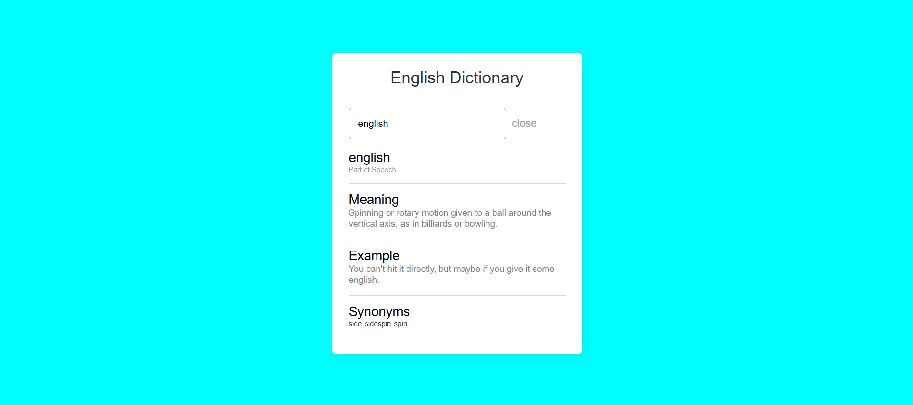

# Online Dictionary

An interactive and user-friendly English dictionary web application that allows users to search for word meanings, examples, synonyms, and more.

## Features

- **Search Functionality**: Search for any English word to view its meaning, part of speech, example usage, and synonyms.
- **Clear Search**: Clear the search input with a single click using the clear button.
- **Responsive Design**: Fully responsive and works seamlessly across all devices.
- **Error Handling**: Displays helpful messages when the word is not found or an error occurs.

## How It Works

1. Type an English word in the search bar and press enter or click the search icon.
2. View the word's:
   - **Meaning**: The definition of the word.
   - **Example**: Example sentences using the word.
   - **Synonyms**: A list of synonyms for the word (if available).
3. Use the **clear button** to reset the search and start over.

## Project Structure

- **HTML**: Structure of the application (`index.html`).
- **CSS**: Styling for the application (`style.css`).
- **JavaScript**: Logic to fetch and display data (`script.js`).

## Screenshots

Here’s how the dictionary looks when you search for a word:

The screenshot above demonstrates the interface with the search bar, word details, and synonyms displayed.

## Benefits

- **User-Friendly**: Provides an intuitive and easy-to-use interface for searching word definitions, examples, and synonyms.
- **Educational**: Perfect for anyone wanting to learn new words, understand their meanings, and hear them used in sentences.
- **Responsive**: The dictionary is mobile-friendly and adjusts to different screen sizes.

## Future Enhancements

- **Audio Pronunciation**: Adding audio support to listen to the pronunciation of words.
- **Expanded Word Database**: Integrating with additional APIs or databases to enhance the word list and details.
- **Offline Mode**: Enabling offline word search functionality for users without an internet connection.

## How to Contribute

1. Fork the repository.
2. Create a new branch (`git checkout -b feature-xyz`).
3. Commit your changes (`git commit -am 'Add new feature'`).
4. Push to the branch (`git push origin feature-xyz`).
5. Create a new Pull Request.

---

Feel free to contribute and suggest improvements. We are always looking to enhance the functionality and usability of the dictionary.

